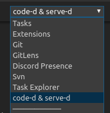

<!-- Documentation generated from docs-src/install.md -->

# Installation

* [Home](index.md)
* **[Installation](install.md)**
* [Tutorial](intro-to-d.md)
	* [Intro to D](intro-to-d.md)
	* [Hello World](hello-world.md)
	* [Building](building.md)
	* [Debugging](debugging.md)
	* [Editing](editing.md)
	* [DUB Package Manager](dub.md)
	* [vibe.d Web App](vibe-d.md)
	* [Configuring non-DUB projects](non-dub.md)
* [Troubleshooting](troubleshooting.md)
* [Changelog](../CHANGELOG.md)

First you have to install code-d in VSCode like any other extension from the side panel in VSCode.

It's possible to manually download the vsix for manual installation from the [Visual Studio Marketplace](https://marketplace.visualstudio.com/items?itemName=webfreak.code-d) or the [Open VSX Registry](https://open-vsx.org/extension/webfreak/code-d).

## First time installing D

If you don't have D installed, code-d will open the [D compiler download page](https://dlang.org/download.html) for you where you simply select your compiler of choice and install it for your OS.

On Windows it's a good idea to restart your PC after D is installed so it is accessible from PATH from within VSCode and its extensions.

After D has been installed, restart VSCode and open a D project, everything should work now.

## Verifying functionality

First open a folder with a D project or a blank one to create a project in. With a folder opened, simply open any D file and then in the bottom panels, check the **Output** tab.

In here at the right you should see a drop-down menu. If you can see `code-d & serve-d` in this then it means the extension is working and running.

If you experience any issues, check this tab for possible errors and log for debugging purposes when submitting an issue.

For more information in case something doesn't work, refer to [Troubleshooting](troubleshooting.md).

## First steps

[Tutorial](intro-to-d.md)
